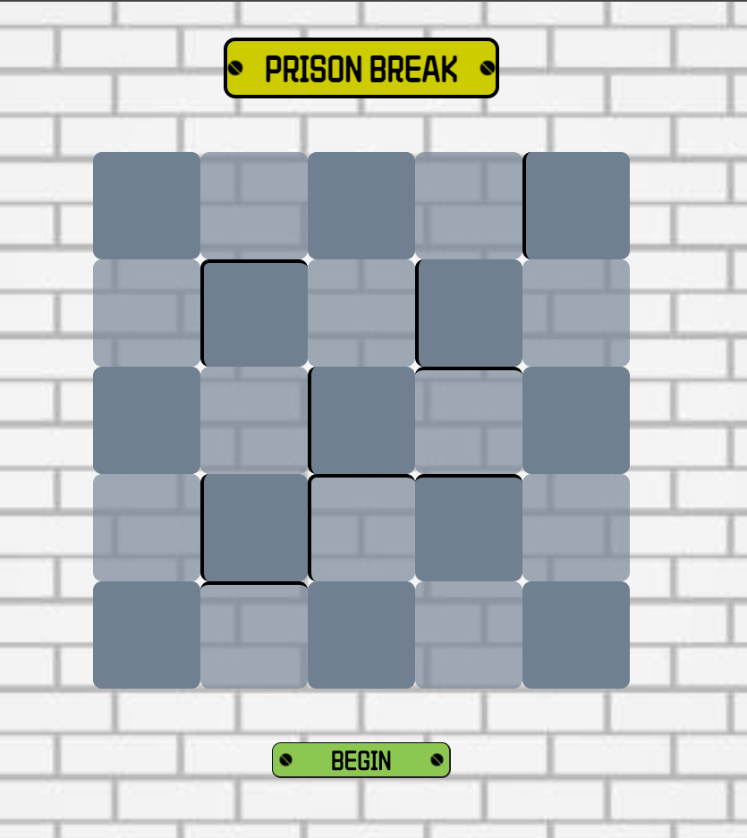

#  __Prison Break__

##  __Rules__
Your incentive is to get to the key that unlocks the prison door and avoid the warden. You win if you can get to the cell in the key with it. You lose if you land on the same cell as the warden (you got caught).

##  __Special Conditions__
- You can only move one cell per move.
- You can't move beyond the edges of the board.
- You are unable to move thtough boundaries.

##  __ScreenShots__

##  __Technologies Used__
- HTML
- CSS
- JavaScript

##  __Try it Out__

Feel free to check out the game [right here](https://m1hammad.github.io/Projects-SEI-48/). You can start the game by clicking the begin button. Good luck and have fun. I'd love your feedback on it.

##  __Further Enhancements__
- Random location for both prisoner and cop everytime the game begins.
- Randomize the maze walls.
- Random location for key but only on the cells closest to the boundary.
- Win and Lose sound effects
- Ability to choose size of grid
- Better AI movement of police